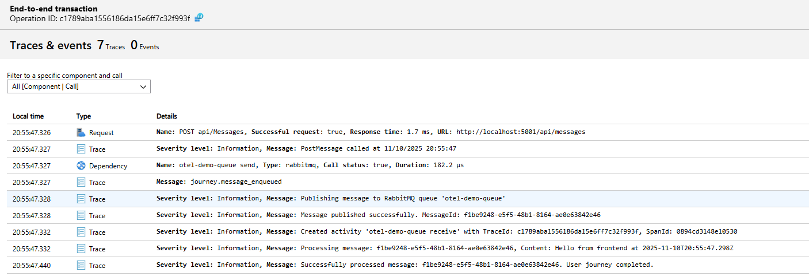

# Azure Application Insights + OpenTelemetry Journey Demo

This repository is a full end-to-end demonstration of how to capture, correlate, and analyse user journeys with OpenTelemetry, Azure Application Insights, and the new .NET Aspire orchestrator. It shows how a single user click flows through a React frontend, an ASP.NET Core producer API, RabbitMQ, and a .NET worker consumer—while staying inside a single distributed trace that can be visualised locally (Jaeger) or in the Azure portal.

Use this repo as a reference when you need to:
- Explain how W3C trace context correlates activities across services and queues.
- Show product owners or support teams how to debug a user journey from click → API → queue → worker.
- Bootstrap a modern Aspire-based developer environment with tracing, metrics, and structured logging already wired in.

> **Need a hands-on checklist?** See [`SETUP.md`](SETUP.md) for prerequisites and run commands. For the detailed walkthrough of the user-journey instrumentation and KQL helpers, open [`USER_JOURNEY_EXAMPLE.md`](USER_JOURNEY_EXAMPLE.md).

---

## 1. Scenario Overview

1. A user clicks **Send Message** in the React app.
2. The frontend emits spans and forwards the trace headers to the Producer API.
3. The API enqueues the message on RabbitMQ, injecting the same trace context into message headers.
4. The Consumer worker processes the message, extracts the trace context, and marks the journey as complete.
5. The OpenTelemetry Collector (running under Aspire) exports every span to:
   - **Jaeger** for local inspection.
   - **Azure Monitor** (Application Insights) for cloud analytics when `AZURE_MONITOR_CONNECTION_STRING` is configured.

All spans—frontend, API, queue send, consumer receive—share a single `traceId`. Logs produced under `ILogger` also include that id, making it easy to pivot between traces and logs.

---

## 2. Architecture

```
React Frontend (Vite) ──HTTP──▶ Producer API (ASP.NET Core)
         │                         │
         │                         └─ RabbitMQ (trace context injected in headers)
         │
         ▼
OpenTelemetry Collector (Aspire container)
         │
         ├─► Jaeger UI (http://localhost:16686)
         └─► Azure Application Insights (via Azure Monitor exporter)
```

### Aspire Resources
| Resource | Purpose | Default Host Endpoint |
| --- | --- | --- |
| `rabbitmq` | Messaging broker + management UI | http://localhost:15672 |
| `otel-collector` | Receives OTLP from services, exports to Jaeger/Azure | Ports 4317 (gRPC) / 4318 (HTTP) |
| `jaeger` | Local trace visualisation | http://localhost:16686 |
| `producer-api` | ASP.NET Core API | http://localhost:5001 |
| `consumer` | .NET worker service | (background worker) |
| `frontend` | React app served via Vite dev server | http://localhost:5173 |

The Aspire dashboard itself runs at https://localhost:17022 (use the login link printed to the console when you start the app host).

---

## 3. Trace Correlation Explained

No custom correlation id is required—the demo relies entirely on **W3C Trace Context**:

1. **Frontend** – The OpenTelemetry web SDK starts a span (`UserJourney:SendMessage`) and stores the current context. The Fetch instrumentation injects `traceparent`, `tracestate`, and `baggage` headers on the POST to `/api/messages`.
2. **Producer API** – ASP.NET Core instrumentation reads those headers. Any spans we create inside the controller run beneath `Activity.Current`, so they share the same `traceId`. Before publishing to RabbitMQ we call `Propagator.Inject` to copy the context into message headers.
3. **Consumer** – The worker extracts the headers via `Propagator.Extract`. If a valid parent exists we start the span with `ActivityKind.Consumer`, preserving the trace.
4. **Logging** – Because logs are written while an `Activity` is active, `ILogger` automatically includes `TraceId` / `SpanId` so log queries and traces remain in sync.

As a result, every span—and every log—can be stitched together in Jaeger or Application Insights using the built-in `operation_Id` (`traceId`).

For a concrete walkthrough (including the actual code snippets), see the "Implementation" section in [`USER_JOURNEY_EXAMPLE.md`](USER_JOURNEY_EXAMPLE.md).

---

## 4. Running the Demo

> Full instructions (including prerequisites and troubleshooting) live in [`SETUP.md`](SETUP.md). The summary below highlights the important steps.

1. **Install prerequisites** – .NET 8, `dotnet workload install aspire`, Docker Desktop, Node.js 18+. Optionally export `AZURE_MONITOR_CONNECTION_STRING`.
2. **Start Aspire:**
   ```bash
   dotnet run --project AzureAppInsights.AppHost
   ```
3. **Open the frontend:** http://localhost:5173 and press **Send Message**.
4. **Inspect locally:** Open http://localhost:16686 in Jaeger to view the trace.
5. **Inspect in Azure:** If you set the connection string, open Application Insights → Transaction Search (or execute the helper KQL queries from the user-journey doc) to see the same trace classified as Requests/Dependencies.

Stopping is as simple as `Ctrl+C` in the terminal running the app host.

---

## 5. Instrumentation Highlights

### Frontend (React)
- Uses OpenTelemetry Web SDK (`@opentelemetry/sdk-trace-web`) with document load, user interaction, and fetch instrumentation.
- Starts a custom `UserJourney:SendMessage` span when the button is clicked, sets journey attributes, and marks success (`journey.api_completed`) when the API returns.
- On failures, records the exception, sets `user.journey.status = error`, and emits `journey.failed` before ending the span.

### Producer API (ASP.NET Core)
- ASP.NET Core instrumentation tracks inbound requests automatically.
- Controller creates an explicit producer span (`queue send`), applies semantic messaging attributes, injects trace context into RabbitMQ properties, and logs structured events.

### Consumer Worker (.NET)
- Extracts the trace context from the message, creates a consumer span, and logs the resume of the trace.
- On success sets `user.journey.step = completed`, `user.journey.status = success`, and records journey duration in `journey.duration_ms`.
- On failure it requeues the message and emits `journey.failed` with detailed error tags.

### Collector & Exporters
- The collector configuration (`otel-collector-config.yaml`) listens on OTLP and fans out to Jaeger and Azure Monitor.
- The shared `AzureAppInsights.ServiceDefaults` project registers both the OTLP exporter (for Jaeger) and the Azure Monitor exporter when the connection string is present.

---

## 6. Analysing User Journeys

All journey metadata lives on spans and events, so you can query it in App Insights or your preferred backend. The [`USER_JOURNEY_EXAMPLE.md`](USER_JOURNEY_EXAMPLE.md) file contains ready-to-run KQL snippets such as:

- Count journeys by step or status.
- Compute completion rate or percentile durations using `journey.duration_ms`.
- Filter by `user.session.id` to explore user behaviour patterns.

The same document also includes a table describing every custom attribute and event emitted along the path.

Here is an example of what it looks like in Azure



---

## 7. Debugging Workflow

1. **Reproduce the issue** – have the user click **Send Message** (or mimic the flow).
2. **Find the trace** – grab the `TraceId` from the consumer logs or Jaeger.
3. **View in Azure** – run the KQL helper to list every span in timestamp order. Look for errors (`user.journey.status = error`) or unusual duration spikes.
4. **Pivot to logs** – use `traceId` to filter structured logs in Application Insights’ Logs blade or via the Aspire dashboard.
5. **Drill into metrics/health** – the Aspire dashboard exposes readiness probes, configuration, and log streams per resource.

This approach mirrors real-world triage where support teams start from a user-reported timestamp and then stitch together the journey using traces and logs.

---

## 8. Repository Layout

| Path | Description |
| --- | --- |
| `frontend/` | React + Vite app with OpenTelemetry web instrumentation. |
| `backend/producer/` | ASP.NET Core API publishing messages to RabbitMQ. |
| `backend/consumer/` | .NET worker consuming messages and completing the journey. |
| `AzureAppInsights.AppHost/` | Aspire app host that orchestrates all resources. |
| `AzureAppInsights.ServiceDefaults/` | Shared service defaults registering OpenTelemetry, Azure Monitor exporter, health checks. |
| `otel-collector-config.yaml` | Collector configuration mounted into the Aspire container. |
| `SETUP.md` | Step-by-step setup & troubleshooting guide. |
| `USER_JOURNEY_EXAMPLE.md` | Detailed instrumentation walkthrough + KQL queries. |

Sample/experimental Aspire apps (`SampleAspire`, `TmpAspireInspect`, `InspectDashboard`) remain for reference but aren’t required to run the main demo.

---

## 9. Next Steps & Extensibility

- **Add more journey types:** Copy the frontend span pattern and choose a new `user.journey.name`. Downstream services can reuse the same attribute conventions.
- **Enrich logs:** `ILogger` already captures `TraceId`; add relevant message data or user info to log scopes for deeper diagnostics.
- **Hook up metrics:** Aspirational dashboards (e.g., Azure Monitor workbooks) can consume the same OpenTelemetry metrics pipeline.
- **Secure production deployments:** Store the connection string in Key Vault or use managed identity with the Azure Monitor exporter; configure proper auth for RabbitMQ/Jaeger.

For questions or ideas, open an issue or experiment with the sample Aspire projects included in the repo.